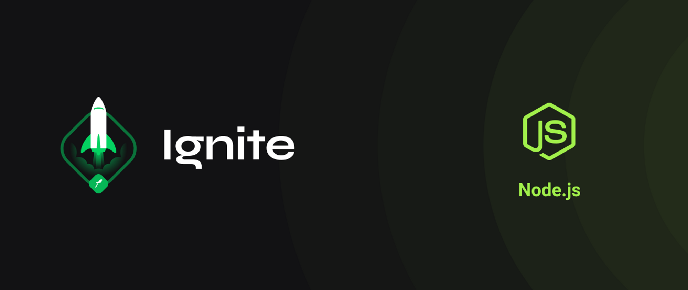

<text><strong>Curso Igniter NodeJs Trilha 2021 - 2022</strong><text>

---

# Capitulo 1

- Treinamento de Rotas, conceitos de GET, POST, PUT, DELETE, PATH

- **Desafio 1 - 2**: <a href="https://github.com/marcosfillipe/nodejsdesafio1">Conceitos do Node.js e Middlewares</a>
  
- **Desafio 3**: <a href="https://github.com/marcosfillipe/nodejsdesafio3">Corrigindo o códigos</a>

# Capitulo 2

- Iniciando Conceitos de API de desenvolvendo e controle de rotas, ultilizando TypeScript, casos de usos, models e repositorios.
